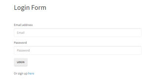

# Reverse Engineering Code Tutorial

## Description 

This is a walk through of the code given in the folder develop.  Folowing comon user store, this tutorial will give an explanation of every file an its purpose.  

## Preview of the application

### Link to access the tutorial:

This tutorial can be access through this link: https://docs.google.com/document/d/1cIE5pcmzrIjMzt_s3HtgaNahrP4JbwowdkbaV6u_OZU/edit?usp=sharing

## MAINTAINER 
This is an individual assignment maintained by Carolina Yoedhana.
* GitHub repo: https://github.com/CarolinaYo/reverse-engineering-code.git
